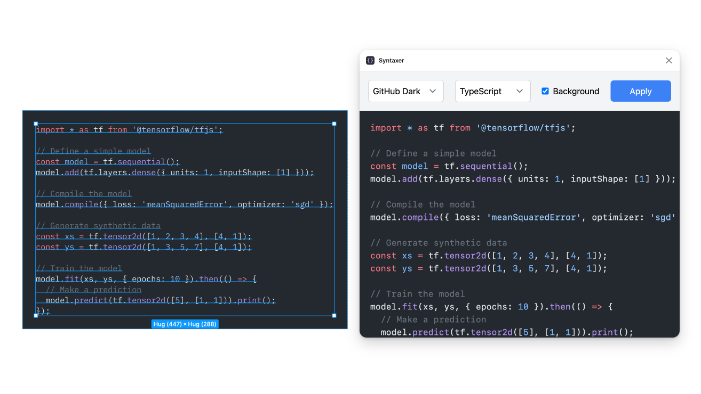

# Syntaxer - Figma Plugin

Syntaxer is a Figma plugin that allows you to color your text like syntax highlighting in Visual Studio Code. It uses the Shiki library to provide accurate and beautiful syntax highlighting for various programming languages.

## Features

- Syntax highlighting for multiple programming languages
- VS Code-like color schemes using [Shiki](https://shiki.style)
- Easy-to-use interface within Figma

## Installation

1. Open Figma and go to the Community tab
2. Search for "Syntaxer"
3. Click "Install"

## Usage

1. Select the text layer you want to apply highlighting to
2. Open the Syntaxer
3. Select a color theme
4. Select a language
5. Click "Apply Highlighting"

## Supported Languages

Syntaxer supports a wide range of programming languages, including but not limited to:

- Python
- JavaScript
- TypeScript
- HTML
- CSS
- JSON
- Markdown
- Java
- C
- C++
- C#
- Go
- R
- Rust
- Swift
- PHP
- Ruby
- SQL
- Shell
- YAML
- XML

## Color Themes

Choose from popular [VS Code themes](https://shiki.style/themes), such as:

- Light+
- Dark+
- GitHub Dark
- GitHub Light
- Min Dark
- Min Light
- Monokai
- Nord
- One Dark Pro
- Poimandres
- Rose Pine
- Slack Dark
- Slack Ochin
- Solarized Dark
- Solarized Light
- Vitesse Dark
- Vitesse Light

## Development

If you want to modify or contribute to the plugin:

1. Clone this repository
2. Install dependencies: `npm install`
3. Make your changes in the `code.ts` file
4. Compile TypeScript to JavaScript: `npm run build`
5. Load the plugin in Figma by selecting "Plugins" > "Development" > "Import plugin from manifest..."

## Feedback and Contributions

We welcome feedback and contributions! Please open an issue or submit a pull request on our GitHub repository.

## License

This project is licensed under the MIT License.
