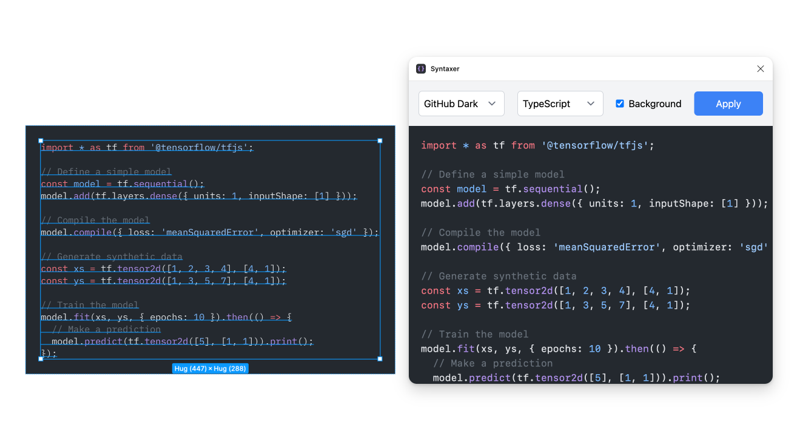

# Syntaxer - Figma Plugin



Syntaxer is a Figma plugin that allows you to color your text like syntax highlighting in Visual Studio Code. It uses the Shiki library to provide accurate and beautiful syntax highlighting for various programming languages.

## Features

- Syntax highlighting for multiple programming languages
- VS Code-like color schemes using [Shiki](https://shiki.style)
- Easy-to-use interface within Figma

## Installation

1. Open Figma and go to the Community tab
2. Search for "Syntaxer"
3. Click "Install"

## Usage

1. Select the text layer you want to apply highlighting to
2. Open the Syntaxer
3. Select a color theme
4. Select a language
5. Click "Apply Highlighting"

### Auto Apply Syntax

You can use the "Auto Apply Syntax" command to apply syntax highlighting with your saved settings.

### Auto Language Detection

The plugin can automatically detect the language of your code. Toggle the "Auto-detect" option to let the plugin choose the language for you.

### Layer Name Language Override

You can force a specific language by naming your text layer with a `#language` prefix, for example:
- `#python` - Forces Python highlighting
- `#js` - Forces JavaScript highlighting

This override works even when auto-detection is enabled and takes precedence over other language selection methods. It's especially useful when working with multiple text layers that use different languages.

## Supported Languages

Syntaxer supports a wide range of programming languages, including but not limited to:

- ABAP
- ActionScript 3
- Ada
- Apache
- Apex
- APL
- AppleScript
- Ara
- ASM
- Astro
- AWK
- Ballerina
- BAT
- Beancount
- Berry
- BibTeX
- Bicep
- Blade
- C
- Cadence
- Clarity
- Clojure
- CMake
- COBOL
- CodeQL
- CoffeeScript
- C++ Macro
- C++
- Crystal
- C#
- CSS
- CSV
- CUE
- Cypher
- D
- Dart
- DAX
- Diff
- Docker
- Dream Maker
- Elixir
- Elm
- ERB
- Erlang
- Fish
- F#
- GDResource
- GDScript
- GDShader
- Gherkin
- Git Commit
- Git Rebase
- Glimmer.js
- Glimmer.ts
- GLSL
- Gnuplot
- Go
- GraphQL
- Groovy
- Hack
- Haml
- Handlebars
- Haskell
- HCL
- HJSON
- HLSL
- HTML
- HTTP
- Imba
- INI
- Java
- JavaScript
- Jinja HTML
- Jinja
- Jison
- JSON
- JSON5
- JSONC
- JSONL
- Jsonnet
- JSSM
- JSX
- Julia
- Kotlin
- Kusto
- LaTeX
- LESS
- Liquid
- Lisp
- Logo
- Lua
- Make
- Markdown
- Marko
- MATLAB
- MDC
- MDX
- Mermaid
- Mojo
- Narrat
- Nextflow
- Nginx
- Nim
- Nix
- Nushell
- Objective-C
- Objective-C++
- OCaml
- Pascal
- Perl
- PHP HTML
- PHP
- PL/SQL
- PostCSS
- PowerQuery
- PowerShell
- Prisma
- Prolog
- Proto
- Pug
- Puppet
- PureScript
- Python
- R
- Raku
- Razor
- Reg
- Rel
- RISC-V
- reStructuredText
- Ruby
- Rust
- SAS
- SASS
- Scala
- Scheme
- SCSS
- ShaderLab
- Shell Script
- Shell Session
- Smalltalk
- Solidity
- SPARQL
- Splunk
- SQL
- SSH Config
- Stata
- Stylus
- Svelte
- Swift
- SystemVerilog
- TASL
- TCL
- TeX
- TOML
- TSX
- Turtle
- Twig
- TypeScript
- V
- VB
- Verilog
- VHDL
- VimL
- Vue HTML
- Vue
- Vyper
- WASM
- Wenyan
- WGSL
- Wolfram
- XML
- XSL
- YAML
- ZenScript

## Color Themes

Choose from popular [VS Code themes](https://shiki.style/themes), such as:

- Light+
- Dark+
- Dracula
- Dracula Soft
- GitHub Dark
- GitHub Dark Dimmed
- GitHub Light
- Material Theme
- Material Theme Darker
- Material Theme Lighter
- Material Theme Ocean
- Material Theme Palenight
- Min Dark
- Min Light
- Monokai
- Nord
- One Dark Pro
- Poimandres
- Rose Pine
- Rose Pine Dawn
- Rose Pine Moon
- Slack Dark
- Slack Ochin
- Solarized Dark
- Solarized Light
- Vitesse Black
- Vitesse Dark
- Vitesse Light

## Development

If you want to modify or contribute to the plugin:

1. Clone this repository
2. Install dependencies: `npm install`
3. Make your changes in the `code.ts` file
4. Compile TypeScript to JavaScript: `npm run build`
5. Load the plugin in Figma by selecting "Plugins" > "Development" > "Import plugin from manifest..."

### Theme and Shiki Bundling

The plugin bundles Shiki and all themes locally to avoid network requests. The bundling process happens in three steps:

1. Download Shiki library: `npm run download-shiki`
2. Download themes: `npm run download-themes`
3. Process UI with theme scripts: `npm run process-ui`

Or run all steps at once with: `npm run prepare-assets`

These steps are automatically run before each build via the `prebuild` script.

### Adding a new theme

1. Add the theme name to the themes list in:
   - `scripts/download-themes.js`
   - `scripts/process-ui.js`
   - Add it to the dropdown in `ui.html`

2. Run `npm run prepare-assets` to download and process the new theme

### Development workflow

During development, you can use:

```bash
npm run watch
```

This will watch for file changes and automatically rebuild the plugin.

## Feedback and Contributions

We welcome feedback and contributions! Please open an issue or submit a pull request on our GitHub repository.

## License

This project is licensed under the MIT License.
